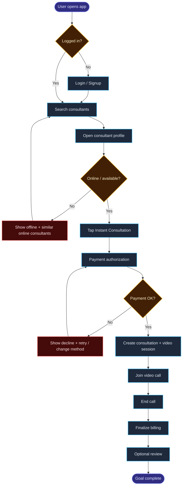

# Instant Consultation

> Status: `Draft` (starter example — fill & lock before major changes)  
> Module: Consultation + Payment + Video  
> Priority: High

This page is a **starter filled example** of the [Feature Template](/features/template). Align details with the real Fixpair routes as you harden the contract.

---

## 1. Goal

> Light user story style — one main story, not a backlog of micro-stories.

**User story:**
```text
As a user,
I want to start an instant consultation with an online consultant,
so that I can get help immediately without waiting for a scheduled slot.
```

**User goal:**  
> Talk to a consultant right now.

**Success looks like:**
- Instant booking confirms after payment authorization
- Video session is ready to join
- Call can end with fair billing and optional review

**Acceptance criteria:**
- [ ] Consultant online/available হলে Instant enable; নাহলে disable + alternatives
- [ ] Payment authorization fail হলে booking confirm হবে না
- [ ] Success-এ consultation + video session ready থাকবে এবং Join করা যাবে
- [ ] Double tap Instant-এ একটাই booking (idempotent)
- [ ] Early disconnect হলে actual duration rules অনুযায়ী fair billing দেখাবে

**Supporting stories (optional):**
```text
As a user, I want clear progress while paying/booking, so that I know the system is working.
As a consultant, I want Instant disabled when I’m unavailable, so that I don’t get impossible bookings.
```

**Out of scope (for this slice):**
- Reschedule
- Callback scheduling
- Tips / gifts

---

## 2. User Journey

> Visual method: [User Journey guide](/guide/user-journey)

### 2.1 Story header

| Field | Value |
|-------|-------|
| **Actor** | End user (client) |
| **Goal** | Talk to a consultant right now |
| **Entry point** | Search / recommendations / consultant profile |
| **Success moment** | Live video session connected |
| **Emotion arc** | Anxious → Evaluating → Hopeful → Relieved |

<div class="journey-callout">

**One-line story:**  
> When a user needs help now, they can find an online consultant, book instantly with clear payment, join a call quickly, and leave knowing billing was fair.

</div>

### 2.2 Stage map

High-level phases only. Detailed flow = [Journey canvas](#22c-journey-canvas-ux-map) + [Visual flow](#24-visual-flow).

<div class="journey-stages">
  <div class="stage"><strong>1. Discover</strong><span>Find consultants</span></div>
  <div class="stage"><strong>2. Decide</strong><span>Trust profile + online</span></div>
  <div class="stage"><strong>3. Book & Pay</strong><span>Instant + authorize</span></div>
  <div class="stage"><strong>4. Experience</strong><span>Live video call</span></div>
  <div class="stage"><strong>5. After</strong><span>Bill + optional review</span></div>
</div>

### 2.2b Emotion lane

<div class="emotion-lane-wrap">
  <p class="emotion-lane-caption">Happy path — one emotion per stage</p>
  <div class="emotion-lane" role="group" aria-label="Instant consultation happy path emotions">
    <div class="emotion-lane__label">Emotions</div>
    <div class="emotion-lane__track">
      <div class="emotion-cell">
        <span class="emotion-cell__face" aria-hidden="true">🙂</span>
        <span class="emotion-cell__name">Interested</span>
      </div>
      <div class="emotion-cell">
        <span class="emotion-cell__face" aria-hidden="true">🤔</span>
        <span class="emotion-cell__name">Evaluating</span>
      </div>
      <div class="emotion-cell">
        <span class="emotion-cell__face" aria-hidden="true">😬</span>
        <span class="emotion-cell__name">Tense</span>
      </div>
      <div class="emotion-cell">
        <span class="emotion-cell__face" aria-hidden="true">😌</span>
        <span class="emotion-cell__name">Relieved</span>
      </div>
      <div class="emotion-cell">
        <span class="emotion-cell__face" aria-hidden="true">😁</span>
        <span class="emotion-cell__name">Happy</span>
      </div>
    </div>
  </div>
</div>

<div class="emotion-lane-wrap">
  <p class="emotion-lane-caption">Failure path — payment declined, then recovery</p>
  <div class="emotion-lane emotion-lane--failure" role="group" aria-label="Payment failure emotion path">
    <div class="emotion-lane__label">Emotions</div>
    <div class="emotion-lane__track">
      <div class="emotion-cell">
        <span class="emotion-cell__face" aria-hidden="true">🙂</span>
        <span class="emotion-cell__name">Interested</span>
      </div>
      <div class="emotion-cell">
        <span class="emotion-cell__face" aria-hidden="true">😠</span>
        <span class="emotion-cell__name">Annoyed</span>
      </div>
      <div class="emotion-cell">
        <span class="emotion-cell__face" aria-hidden="true">😤</span>
        <span class="emotion-cell__name">Frustrated</span>
      </div>
      <div class="emotion-cell">
        <span class="emotion-cell__face" aria-hidden="true">😟</span>
        <span class="emotion-cell__name">Worried</span>
      </div>
      <div class="emotion-cell">
        <span class="emotion-cell__face" aria-hidden="true">😁</span>
        <span class="emotion-cell__name">Happy</span>
      </div>
    </div>
  </div>
</div>

### 2.2c Journey canvas (UX map)

> Stages as columns · layers as rows.  
> Complements the detailed [step board](#23-step-by-step-board) below.

<div class="journey-canvas-wrap">
<p class="journey-canvas-caption">Instant Consultation — experience overview</p>
<div class="journey-canvas" style="--jc-stages: 5" role="region" aria-label="User journey canvas">
<div class="jc-cell jc-cell--corner">Stages</div>
<div class="jc-cell jc-cell--stage"><span class="jc-stage-title"><span>Stage 1</span><span class="jc-stage-name">Discover</span></span><span class="jc-arrow" aria-hidden="true">→</span></div>
<div class="jc-cell jc-cell--stage"><span class="jc-stage-title"><span>Stage 2</span><span class="jc-stage-name">Decide</span></span><span class="jc-arrow" aria-hidden="true">→</span></div>
<div class="jc-cell jc-cell--stage"><span class="jc-stage-title"><span>Stage 3</span><span class="jc-stage-name">Book &amp; Pay</span></span><span class="jc-arrow" aria-hidden="true">→</span></div>
<div class="jc-cell jc-cell--stage"><span class="jc-stage-title"><span>Stage 4</span><span class="jc-stage-name">Experience</span></span><span class="jc-arrow" aria-hidden="true">→</span></div>
<div class="jc-cell jc-cell--stage"><span class="jc-stage-title"><span>Stage 5</span><span class="jc-stage-name">After</span></span></div>
<div class="jc-cell jc-cell--label">Goals</div>
<div class="jc-cell">Find help right now</div>
<div class="jc-cell">Pick a trusted online consultant</div>
<div class="jc-cell">Book instantly without billing fear</div>
<div class="jc-cell">Have a useful live consultation</div>
<div class="jc-cell">Understand charge + optionally review</div>
<div class="jc-cell jc-cell--label">Actions</div>
<div class="jc-cell"><ol class="jc-list"><li>Open app</li><li>Search / browse</li></ol></div>
<div class="jc-cell"><ol class="jc-list"><li>Open profile</li><li>Check online + rate</li></ol></div>
<div class="jc-cell"><ol class="jc-list"><li>Tap Instant</li><li>Authorize payment</li></ol></div>
<div class="jc-cell"><ol class="jc-list"><li>Join call</li><li>Talk / end session</li></ol></div>
<div class="jc-cell"><ol class="jc-list"><li>View summary</li><li>Leave review</li></ol></div>
<div class="jc-cell jc-cell--label">Thoughts</div>
<div class="jc-cell">“Who can help me now?”</div>
<div class="jc-cell">“Are they good &amp; free?”</div>
<div class="jc-cell">“Will I be charged fairly?”</div>
<div class="jc-cell">“Am I connected? Is this helping?”</div>
<div class="jc-cell">“What did I pay? Should I rate?”</div>
<div class="jc-cell jc-cell--label">Pain points</div>
<div class="jc-cell">Hard to spot who is free now</div>
<div class="jc-cell">Weak trust / unclear online signal</div>
<div class="jc-cell">Silent waiting, payment anxiety</div>
<div class="jc-cell">Drop risk, unclear mid-call status</div>
<div class="jc-cell">Confusing early-end billing</div>
<div class="jc-cell jc-cell--label">Emotions</div>
<div class="jc-cell jc-cell--emotions"><span class="jc-emo-face" aria-hidden="true">🙂</span><span class="jc-emo-name">Interested</span></div>
<div class="jc-cell jc-cell--emotions"><span class="jc-emo-face" aria-hidden="true">🤔</span><span class="jc-emo-name">Evaluating</span></div>
<div class="jc-cell jc-cell--emotions"><span class="jc-emo-face" aria-hidden="true">😬</span><span class="jc-emo-name">Tense</span></div>
<div class="jc-cell jc-cell--emotions"><span class="jc-emo-face" aria-hidden="true">😌</span><span class="jc-emo-name">Relieved</span></div>
<div class="jc-cell jc-cell--emotions"><span class="jc-emo-face" aria-hidden="true">😁</span><span class="jc-emo-name">Happy</span></div>
<div class="jc-cell jc-cell--label">Touchpoints</div>
<div class="jc-cell"><div class="jc-touch"><span class="jc-touch-icon" title="Mobile">📱</span><span class="jc-touch-icon" title="Search">🔎</span></div><div class="jc-note">List / search</div></div>
<div class="jc-cell"><div class="jc-touch"><span class="jc-touch-icon" title="Profile">👤</span><span class="jc-touch-icon" title="Status">🟢</span></div><div class="jc-note">Profile + online CTA</div></div>
<div class="jc-cell"><div class="jc-touch"><span class="jc-touch-icon" title="Pay">💳</span><span class="jc-touch-icon" title="App">📱</span></div><div class="jc-note">Pay sheet + progress</div></div>
<div class="jc-cell"><div class="jc-touch"><span class="jc-touch-icon" title="Video">🎥</span><span class="jc-touch-icon" title="Consultant">👤</span></div><div class="jc-note">Video session</div></div>
<div class="jc-cell"><div class="jc-touch"><span class="jc-touch-icon" title="Summary">🧾</span><span class="jc-touch-icon" title="Review">⭐</span></div><div class="jc-note">Summary + review</div></div>
<div class="jc-cell jc-cell--label jc-cell--opportunity-label">Opportunities</div>
<div class="jc-cell jc-cell--opportunity"><ol class="jc-list"><li>Strong online / ETA badges</li><li>Recommended free now</li></ol></div>
<div class="jc-cell jc-cell--opportunity"><ol class="jc-list"><li>Clear rate + trust signals</li><li>Disable Instant if offline</li></ol></div>
<div class="jc-cell jc-cell--opportunity"><ol class="jc-list"><li>Pay → Confirm → Join steps</li><li>Fair-charge copy</li></ol></div>
<div class="jc-cell jc-cell--opportunity"><ol class="jc-list"><li>Stable join + reconnect UX</li><li>No billing noise mid-call</li></ol></div>
<div class="jc-cell jc-cell--opportunity"><ol class="jc-list"><li>Plain billing summary</li><li>Optional review nudge</li></ol></div>
</div>
</div>

### 2.3 Step-by-step board

<div class="journey-board">

| Step | Stage | User action | Screen / UI | User thinking | Emotion | System response | Backend? |
|------|-------|-------------|-------------|-----------------|---------|-----------------|----------|
| <span class="step-no">1</span> | <span class="stage-chip stage-chip--discover">Discover</span> | Opens app / search | <span class="screen-tag">Consultant list</span> | <span class="user-thought">“Who can help me now?”</span> | <span class="emotion-pill emotion-pill--tense"><span class="emotion-pill__face">😰</span>Anxious</span> | List + filters + online signals | <span class="backend-flag backend-flag--yes" title="Backend touch">✓</span> |
| <span class="step-no">2</span> | <span class="stage-chip stage-chip--decide">Decide</span> | Opens profile | <span class="screen-tag">Profile</span> | <span class="user-thought">“Are they good & free?”</span> | <span class="emotion-pill emotion-pill--neutral"><span class="emotion-pill__face">🤔</span>Evaluating</span> | Rate, rating, online status | <span class="backend-flag backend-flag--yes" title="Backend touch">✓</span> |
| <span class="step-no">3</span> | <span class="stage-chip stage-chip--decide">Decide</span> | Checks availability | <span class="screen-tag">Online badge / CTA</span> | <span class="user-thought">“Can I start immediately?”</span> | <span class="emotion-pill emotion-pill--tense"><span class="emotion-pill__face">🤨</span>Cautious</span> | Enable/disable Instant | <span class="backend-flag backend-flag--yes" title="Backend touch">✓</span> |
| <span class="step-no">4</span> | <span class="stage-chip stage-chip--book">Book & Pay</span> | Taps Instant | <span class="screen-tag">Confirm / pay sheet</span> | <span class="user-thought">“Will I be charged fairly?”</span> | <span class="emotion-pill emotion-pill--positive"><span class="emotion-pill__face">🙂</span>Hopeful</span> | Start auth + booking pipeline | <span class="backend-flag backend-flag--yes" title="Backend touch">✓</span> |
| <span class="step-no">5</span> | <span class="stage-chip stage-chip--book">Book & Pay</span> | Waits for confirm | <span class="screen-tag">Paying → Booking</span> | <span class="user-thought">“Is it working?”</span> | <span class="emotion-pill emotion-pill--tense"><span class="emotion-pill__face">😬</span>Tense</span> | Status updates / loading truth | <span class="backend-flag backend-flag--yes" title="Backend touch">✓</span> |
| <span class="step-no">6</span> | <span class="stage-chip stage-chip--experience">Experience</span> | Joins call | <span class="screen-tag">Video lobby / call</span> | <span class="user-thought">“Am I connected?”</span> | <span class="emotion-pill emotion-pill--positive"><span class="emotion-pill__face">😌</span>Relieved</span> | Session ready + token | <span class="backend-flag backend-flag--yes" title="Backend touch">✓</span> |
| <span class="step-no">7</span> | <span class="stage-chip stage-chip--experience">Experience</span> | Talks / ends | <span class="screen-tag">In-call UI</span> | <span class="user-thought">“This helped”</span> | <span class="emotion-pill emotion-pill--neutral"><span class="emotion-pill__face">🎯</span>Focused</span> | Track session lifecycle | <span class="backend-flag backend-flag--yes" title="Backend touch">✓</span> |
| <span class="step-no">8</span> | <span class="stage-chip stage-chip--after">After</span> | Sees summary | <span class="screen-tag">End summary</span> | <span class="user-thought">“What did I pay?”</span> | <span class="emotion-pill emotion-pill--neutral"><span class="emotion-pill__face">🧐</span>Curious</span> | Finalize billing | <span class="backend-flag backend-flag--yes" title="Backend touch">✓</span> |
| <span class="step-no">9</span> | <span class="stage-chip stage-chip--after">After</span> | Leaves review | <span class="screen-tag">Review form</span> | <span class="user-thought">“Should I rate?”</span> | <span class="emotion-pill emotion-pill--neutral"><span class="emotion-pill__face">🪞</span>Reflective</span> | Optional review create | <span class="backend-flag backend-flag--yes" title="Backend touch">✓</span> |

</div>

### 2.4 Visual flow



### 2.5 Decision points

| Decision | If Yes | If No | UI treatment |
|----------|--------|-------|--------------|
| Online / available? | Enable Instant CTA | Disable Instant + suggest alternatives | Strong badge + helper text |
| Payment authorized? | Create booking + session | Stay on pay state with retry | Clear error, no fake “Booked” |
| Session ready? | Show Join | Waiting / recovery | Lobby progress |
| Call ended early? | Show fair duration summary | — | Transparent billing copy |

### 2.6 Failure + recovery

| Failure | User feels | What user sees | Recovery path | System must do |
|---------|------------|----------------|---------------|----------------|
| Consultant unavailable | <span class="emotion-pill emotion-pill--negative"><span class="emotion-pill__face">😤</span>Frustrated</span> | Unavailable + similar list | Pick another | `409 CONSULTANT_UNAVAILABLE`, no booking |
| Card declined | <span class="emotion-pill emotion-pill--negative"><span class="emotion-pill__face">😟</span>Worried</span> | Honest decline message | Retry / other method | No confirmed booking |
| Double tap Instant | — | Same success result | — | Idempotent create |
| Session create fails after pay | <span class="emotion-pill emotion-pill--negative"><span class="emotion-pill__face">😠</span>Angry</span> | Recovery message | Retry join / support path | Compensate; no orphan confirmed state |
| Early disconnect | <span class="emotion-pill emotion-pill--tense"><span class="emotion-pill__face">🤨</span>Unsure</span> | Duration + charge explanation | Support / invoice view | Bill by actual rules |

### 2.7 Experience timeline

| Time | Moment | User should feel / see |
|------|--------|------------------------|
| T0 | Open profile | Clear online + price signal |
| T+10s | Tap Instant | Confirm what happens next |
| T+25s | Payment confirming | “Authorizing payment…” not silent spinner |
| T+40s | Join ready | One clear Join CTA |
| In call | Live session | Stable controls, no billing noise mid-call |
| End | Summary | Duration, amount logic, review optional |

### 2.8 Pain → Opportunity

| Pain point | Stage | Opportunity |
|------------|-------|-------------|
| Hard to know who is free now | Decide | Strong online / busy / ETA UI |
| Fear of wrong charge | Book & Pay | Show estimate + when capture happens |
| Silent waiting after Instant | Book & Pay | Step progress: Pay → Confirm → Join |
| Unclear early-end billing | After | Plain-language summary + invoice link |

---

## 3. Product Rules

1. `userId` always from JWT — never from body
2. Amount calculated on server from consultant rate
3. No confirmed booking without successful payment authorization
4. Only consultation owner (or allowed roles) can join/end
5. Invalid status transitions must fail with conflict/error code

---

## 4. Information Architecture

```text
User ──books──> Consultation <──with── Consultant
Consultation ──has──> Payment
Consultation ──has──> VideoSession
Consultation ──may have──> Review
```

Canonical names: `Consultation`, `Payment`, `VideoSession`  
Avoid mixing random synonyms in API (`appointment`, `talk`, `meet`) unless product-wide rename.

---

## 5. States (draft)

| Entity | Example statuses |
|--------|------------------|
| Consultation | pending / confirmed / in_progress / completed / cancelled |
| Payment | authorized / captured / failed / refunded |
| VideoSession | ready / in_progress / ended |

> Lock exact enum strings to match production models before coding new transitions.

---

## 6. Screen → API Map (align with current Fixpair)

| User moment | Current / target API | Notes |
|-------------|----------------------|-------|
| Consultant list | `GET /api/v1/user/consultants` | pagination + filters |
| Consultant detail | `GET /api/v1/user/:id` | online / rate |
| Book instant | `POST /api/v1/consultation/book` | `bookingType: "instant"` + auth USER |
| My bookings | `GET /api/v1/consultation/my-bookings` | owner scoped |
| Join call / token | `POST /api/v1/video-session/join` | after confirmed / session ready |
| End call | `POST /api/v1/video-session/end` | triggers billing finalize path |

Framework for designing each endpoint: [Response Architecture — sequence](/standards/response-architecture#endpoint-design-sequence-before-coding)

---

## 7. API contracts + endpoint design sequence

> Standards hold the **12-step framework**. Below is that framework **applied** to Instant Consultation’s critical endpoints.  
> Envelope: [API Response](/standards/api-response) · Codes: [Error Codes](/standards/error-codes) · Status: [HTTP Status](/standards/http-status)

---

### 7.1 Book instant — `POST /api/v1/consultation/book`

#### Endpoint design sequence (applied)

| # | Step | Instant Consultation answer |
|---|------|-----------------------------|
| 1 | **WHO** | Authenticated **USER** (JWT). Not consultant/admin for this intent. |
| 2 | **INTENT** | Start an **instant** consultation with a chosen consultant now. |
| 3 | **RESOURCE** | Creates/updates **Consultation**; side effects on **Payment** (authorize) and **VideoSession** (ready). |
| 4 | **RULES** | `userId` from JWT only; amount from consultant rate (server); consultant must be available/online; no confirm without successful payment auth; client cannot set `status` / final `amount`. |
| 5 | **STATE** | Success path → consultation **confirmed** (or project equivalent) + session **ready**. Fail path → no confirmed booking (or explicit failed/pending-payment cleanup). Invalid: confirm while payment failed. |
| 6 | **SUCCESS** | Client needs consultation id + status + type, enough session info to proceed to join (session id / ready flag), optional amount estimate actually authorized — **DTO only**. |
| 7 | **FAILURE** | Validation; unauthorized; consultant not found; consultant unavailable; payment failed; price changed (if expectedAmount used); idempotency conflict; rate limit. |
| 8 | **STATUS** | `201` created OK · `400` validation · `401` auth · `404` consultant · `409` unavailable / payment / state / idempotency · `503` payment provider down. |
| 9 | **CONTRACT** | See request/response below — stable field names; no raw mongoose. |
| 10 | **SCALE** | **Idempotency-Key** recommended (double tap). Concurrency: lock/check availability so two users don’t both “win” same consultant incorrectly. Not a list → no pagination. |
| 11 | **SECURITY** | Never accept `userId`/`amount`/`status` from body as source of truth. Don’t return `passwordHash`, internal Stripe secrets, internal notes. |
| 12 | **OBSERVABILITY** | Log `requestId`, `userId`, `consultantId`, consultation id, payment outcome (no card PAN). Target: `meta.requestId` in JSON ([Response gaps](/standards/response-gaps)). |

#### Contract

```http
POST /api/v1/consultation/book
Authorization: Bearer <access_token>
Idempotency-Key: <optional-but-recommended-uuid>
Content-Type: application/json
```

**Request body** (aligns with Zod `createBookingZodSchema`):

```json
{
  "consultantId": "65f…",
  "bookingType": "instant",
  "notes": "optional"
}
```

| Field | Client? | Notes |
|-------|---------|--------|
| `consultantId` | required | Must exist and be bookable |
| `bookingType` | required | `"instant"` for this feature |
| `date` / `startTime` / `endTime` | no for instant | Used by scheduled |
| `userId` / `amount` / `status` | **forbidden as authority** | Server-owned |

**Success — `201 Created`** (target envelope):

```json
{
  "success": true,
  "message": "Instant consultation booked successfully",
  "data": {
    "consultation": {
      "id": "…",
      "status": "confirmed",
      "bookingType": "instant",
      "consultantId": "…",
      "userId": "…"
    },
    "session": {
      "id": "…",
      "status": "ready"
    },
    "payment": {
      "status": "authorized",
      "amount": { "amount": 0, "currency": "USD" }
    }
  }
}
```

> Shape may match current controller DTO partially — lock fields before frontend hardcodes. Prefer nested money `{ amount, currency }` going forward.

**Failures**

| HTTP | Code | When | UI action |
|------|------|------|-----------|
| 400 | `VALIDATION_ERROR` | Bad/missing body | Show field errors |
| 401 | `UNAUTHORIZED` | No/invalid token | Login |
| 404 | `CONSULTANT_NOT_FOUND` | Unknown consultant | Back to list |
| 409 | `CONSULTANT_UNAVAILABLE` | Offline/busy | Alternatives |
| 409 | `PAYMENT_FAILED` | Auth/charge declined | Retry / change method |
| 409 | `PRICE_CHANGED` | Optional expectedAmount mismatch | Refresh price |
| 409 | `IDEMPOTENCY_CONFLICT` | Same key, different body | Stop retry with new body |
| 503 | `SERVICE_UNAVAILABLE` | Stripe/provider down | Retry later |

---

### 7.2 Join session — `POST /api/v1/video-session/join`

#### Endpoint design sequence (applied)

| # | Step | Answer |
|---|------|--------|
| 1 | **WHO** | **USER** or **CONSULTANT** who is a party to the consultation/session. |
| 2 | **INTENT** | Enter the live video session (get token / join payload). |
| 3 | **RESOURCE** | **VideoSession** (reads Consultation for authZ/state). |
| 4 | **RULES** | Only participants; consultation must be in a joinable state (e.g. confirmed / ongoing); session must be ready or joinable. |
| 5 | **STATE** | Session → in progress (or equivalent) when both/rules say so. Reject join if cancelled/completed/expired. |
| 6 | **SUCCESS** | Agora (or provider) token, channel/session identifiers, role — enough for client RTC join. No provider master secrets. |
| 7 | **FAILURE** | Unauthorized; forbidden (not a party); not found; invalid state; session not ready. |
| 8 | **STATUS** | `200` OK · `401` · `403` · `404` · `409` invalid state. |
| 9 | **CONTRACT** | Body includes session/consultation reference per Zod `joinSession`; response DTO with token + channel metadata. |
| 10 | **SCALE** | Idempotent join OK (same token policy / refresh rules documented). Not paginated. |
| 11 | **SECURITY** | Ownership check; short-lived token only; never expose app certificate / master key. |
| 12 | **OBSERVABILITY** | Log userId, sessionId, consultationId, join success/fail reason code. |

#### Contract (sketch — lock to `VideoSessionValidation.joinSessionZodSchema`)

```http
POST /api/v1/video-session/join
Authorization: Bearer <access_token>
```

**Success — `200`:** `{ success, message, data: { token, channelName / sessionId, uid, … } }`  
**Errors:** `401` `UNAUTHORIZED` · `403` `FORBIDDEN` · `404` `NOT_FOUND` · `409` `INVALID_STATE_TRANSITION`

---

### 7.3 End session — `POST /api/v1/video-session/end`

#### Endpoint design sequence (applied)

| # | Step | Answer |
|---|------|--------|
| 1 | **WHO** | Participating **USER** or **CONSULTANT**. |
| 2 | **INTENT** | End the live call and allow billing finalize / summary path. |
| 3 | **RESOURCE** | **VideoSession** end; side effects on **Consultation** status and **Payment** capture/finalize per billing rules. |
| 4 | **RULES** | Only parties; only from in-progress (or allowed) states; billing uses server duration/rules (early end → fair charge). |
| 5 | **STATE** | Session → ended; consultation → completed (or rules-based); payment → captured/finalized as designed. Reject end if already ended (prefer **idempotent 200** with same summary). |
| 6 | **SUCCESS** | End confirmation + summary fields client needs (duration, amount charged/pending) as DTO — for After stage UI. |
| 7 | **FAILURE** | Auth; forbidden; not found; invalid state (never started); billing provider failure. |
| 8 | **STATUS** | `200` · `401` · `403` · `404` · `409` · `503` provider. |
| 9 | **CONTRACT** | Body per `endSessionZodSchema`; response summary DTO. |
| 10 | **SCALE** | Idempotent end (second call safe). Concurrency: one finalize wins. |
| 11 | **SECURITY** | No client-supplied final charge amount as authority; owner-only. |
| 12 | **OBSERVABILITY** | Log sessionId, consultationId, duration, billing result, requestId. |

#### Contract (sketch)

```http
POST /api/v1/video-session/end
Authorization: Bearer <access_token>
```

**Success — `200`:** `{ success, message, data: { session, consultationStatus, billingSummary? } }`  
**Errors:** same family as join + `PAYMENT_FAILED` / `SERVICE_UNAVAILABLE` if finalize fails (define compensate behavior in billing rules).

---

### 7.4 Out of scope for this feature slice (document elsewhere)

- Full Stripe webhook catalog  
- Reschedule / scheduled / callback book variants  
- Admin force-end  

---

## 8. Data model notes

> App-wide map: [Data Model](/product/data-model) · Names: [Glossary](/product/glossary) · API DTOs: [§7 contracts](#7-api-contracts--endpoint-design-sequence) + [Response Architecture](/standards/response-architecture)

### Collections touched (Instant)

| Collection | Role in this flow |
|------------|-------------------|
| `User` | Client + consultant identities / rate |
| `Consultation` | Instant booking row + billing summary fields |
| `Transaction` | Payment authorization / later capture |
| `VideoSession` | 1:1 live session for the consultation |
| `BillingTransaction` | Minute/ledger rows during/after call (as implemented) |
| `Invoice` | Created on settle/summary path when applicable |
| `Availability` | Indirect — consultant cannot be booked if blocked (scheduled more than instant, but still check online/busy rules) |

Code: `consultation.model.ts`, `payment.model.ts`, `videoSession.model.ts`.

### Important fields

| Entity | Field | Why |
|--------|-------|-----|
| Consultation | `user`, `consultant` | Ownership / authZ |
| Consultation | `bookingType: "instant"` | Feature discriminator |
| Consultation | `status` | pending → confirmed → ongoing → completed / cancelled… |
| Consultation | `paymentStatus`, `billingStatus` | Money lifecycle on the booking |
| Consultation | `perMinuteRate`, `authorizedAmount`, `consumedAmount`, `preAuthIntentId` | Server-owned pricing/billing |
| VideoSession | `consultation` (unique) | One session per consultation |
| VideoSession | `channelName`, `status` | Join/end RTC |
| Transaction | `transactionId` (unique), `type`, `status`, `amount` | Provider truth + idempotency |

### Indexes / uniqueness (relevant)

- `VideoSession`: unique on `consultation`, unique on `channelName`
- `Transaction`: unique on `transactionId`
- `BillingTransaction`: unique on `{ consultationId, billingMinute, type }`
- `Consultation`: `{ user, status }`, `{ status, bookingType }` for lists/filters
- Slot index `{ consultant, date, startTime, endTime }` — critical for scheduled; instant still must enforce “not double-live” via status/availability rules

### Money / ledger / audit

- [x] Needed
- Notes:
  - Authorize before confirm; failed auth → no successful confirmed booking (or compensate)
  - Amounts calculated server-side from consultant rate
  - Persist provider refs (`preAuthIntentId` / `Transaction.transactionId`) for retry & support
  - End session drives capture/finalize + optional invoice; prove with `src/app/__tests__/billing/*` and `03-instant-session.e2e.spec.ts`

### Concurrency / locking

- Double-tap Book → Idempotency-Key + safe create (one consultation)
- Two users racing same consultant → availability/busy check must make one fail with `CONSULTANT_UNAVAILABLE` (or equivalent)
- Join/end → respect `VideoSession.status`; end should be idempotent
- Billing tick vs end → single finalize winner (billing tests)

### Invariants

1. No `paymentStatus` success without corresponding auth/capture trail when money moved  
2. At most one `VideoSession` per `Consultation`  
3. API responses never expose password hashes or provider master secrets (token for join is short-lived client token only)  
4. Enum strings match [Data Model enums](/product/data-model#critical-enums-keep-api--db-aligned)

---

## 9. Thin slice

```text
Auth USER
 → validate body (bookingType=instant)
 → availability check (concurrency-safe)
 → price calculation (server)
 → payment authorization
 → create consultation (confirmed only if auth OK)
 → create/ready video session
 → return DTO (no secrets)
 → client: POST /video-session/join
 → later: POST /video-session/end → billing finalize
```

---

## 10. Definition of Done (shortcut)

Use the full checklist in [Feature Template](/features/template#12-definition-of-done). Minimum before calling this Done:

- [ ] Failure paths documented
- [ ] Screen→API map matches real routes
- [ ] Endpoint design sequence filled for Book / Join / End
- [ ] Data model notes filled (collections, money, concurrency)
- [ ] Error codes mapped to UI actions
- [ ] Happy + at least 2 failure tests (`03-instant-session` / billing as relevant)
- [ ] No sensitive fields in responses
