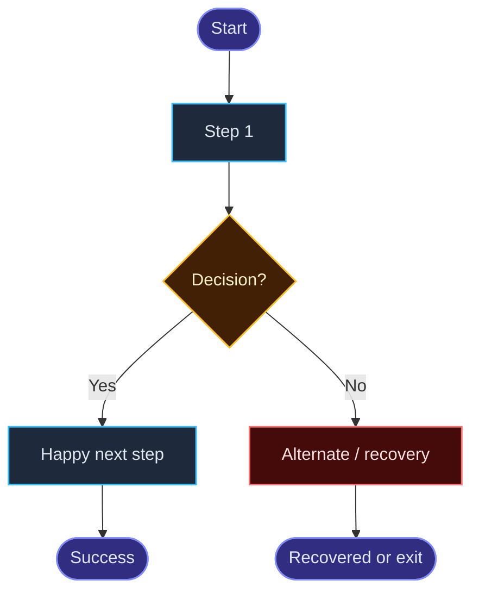

# Feature Template

> Copy this page for every new feature.  
> Status: `Draft` → `Spec Ready` → `Contract Ready` → `Building` → `Verifying` → `Done`

---

## 0. Meta

- **Feature:**
- **Module / Area:** (Consultation / Payment / Video / …)
- **Priority:** High / Medium / Low
- **Owner:**
- **Date:** YYYY-MM-DD
- **Out of scope (now):**

---

## 1. Goal (Product)

> Keep this **light**: 1 user story + short acceptance.  
> Do not split into many micro-stories / story tickets.

**User story:**
```text
As a <actor>,
I want <capability>,
so that <benefit>.
```

**User goal (1 line):**
>

**Success looks like:**
-

**Acceptance criteria:**
- [ ]
- [ ]
- [ ]
- [ ]

**Supporting stories (optional, max 2–3):**
```text
As a …, I want …, so that …
As a …, I want …, so that …
```

**Business value:**
-

**Out of scope (now):**
-

---

## 2. User Journey (Product)

> How to fill this visually: [User Journey guide](/guide/user-journey)

### 2.1 Story header

| Field | Value |
|-------|-------|
| **Actor** | |
| **Goal** | |
| **Entry point** | |
| **Success moment** | |
| **Emotion arc** | e.g. Anxious → Confident → Relieved |

<div class="journey-callout">

**One-line story:**  
> When _[actor]_ wants _[goal]_, they go from _[entry]_ to _[success]_ without confusion or unfair surprises.

</div>

### 2.2 Stage map

Replace labels for your feature.  
Keep this as **phase names only** — don’t duplicate the same flow as Mermaid here (detail goes in canvas + visual flow).

<div class="journey-stages">
  <div class="stage"><strong>1. Discover</strong><span>Find option / person</span></div>
  <div class="stage"><strong>2. Decide</strong><span>Trust & choose</span></div>
  <div class="stage"><strong>3. Book & Pay</strong><span>Commit safely</span></div>
  <div class="stage"><strong>4. Experience</strong><span>Core value moment</span></div>
  <div class="stage"><strong>5. After</strong><span>Bill / review / next</span></div>
</div>

### 2.2b Emotion lane (visual)

> Align one emotion cell per stage (or per major step).  
> How to use: [User Journey — Emotion lane](/guide/user-journey#emotion-lane-visual)

<div class="emotion-lane-wrap">
  <p class="emotion-lane-caption">Happy path emotions (edit faces + labels)</p>
  <div class="emotion-lane" role="group" aria-label="Happy path emotions">
    <div class="emotion-lane__label">Emotions</div>
    <div class="emotion-lane__track">
      <div class="emotion-cell">
        <span class="emotion-cell__face" aria-hidden="true">🙂</span>
        <span class="emotion-cell__name">Interested</span>
      </div>
      <div class="emotion-cell">
        <span class="emotion-cell__face" aria-hidden="true">🤔</span>
        <span class="emotion-cell__name">Evaluating</span>
      </div>
      <div class="emotion-cell">
        <span class="emotion-cell__face" aria-hidden="true">😬</span>
        <span class="emotion-cell__name">Tense</span>
      </div>
      <div class="emotion-cell">
        <span class="emotion-cell__face" aria-hidden="true">😌</span>
        <span class="emotion-cell__name">Relieved</span>
      </div>
      <div class="emotion-cell">
        <span class="emotion-cell__face" aria-hidden="true">😁</span>
        <span class="emotion-cell__name">Happy</span>
      </div>
    </div>
  </div>
</div>

<div class="emotion-lane-wrap">
  <p class="emotion-lane-caption">Failure path emotions (optional — pick your worst path)</p>
  <div class="emotion-lane emotion-lane--failure" role="group" aria-label="Failure path emotions">
    <div class="emotion-lane__label">Emotions</div>
    <div class="emotion-lane__track">
      <div class="emotion-cell">
        <span class="emotion-cell__face" aria-hidden="true">🙂</span>
        <span class="emotion-cell__name">Interested</span>
      </div>
      <div class="emotion-cell">
        <span class="emotion-cell__face" aria-hidden="true">😠</span>
        <span class="emotion-cell__name">Annoyed</span>
      </div>
      <div class="emotion-cell">
        <span class="emotion-cell__face" aria-hidden="true">😤</span>
        <span class="emotion-cell__name">Frustrated</span>
      </div>
      <div class="emotion-cell">
        <span class="emotion-cell__face" aria-hidden="true">😟</span>
        <span class="emotion-cell__name">Worried</span>
      </div>
      <div class="emotion-cell">
        <span class="emotion-cell__face" aria-hidden="true">🙂</span>
        <span class="emotion-cell__name">Recovered</span>
      </div>
    </div>
  </div>
</div>

### 2.2c Journey canvas (UX map)

> Stages as **columns** · Goals / Actions / Thoughts / Pain / Emotions / Touchpoints / Opportunities as **rows**.  
> Use this for product storytelling. Use the step board below for backend mapping.

Copy and edit cell text. Change `--jc-stages` if you have fewer/more stages.

::: warning
Canvas HTML block-এর ভিতরে **blank line দিও না** — Markdown HTML render ভেঙে raw tags দেখাবে।
:::

<div class="journey-canvas-wrap">
<p class="journey-canvas-caption">Journey canvas template (5 stages)</p>
<div class="journey-canvas" style="--jc-stages: 5" role="region" aria-label="User journey canvas template">
<div class="jc-cell jc-cell--corner">Stages</div>
<div class="jc-cell jc-cell--stage"><span class="jc-stage-title"><span>Stage 1</span><span class="jc-stage-name">Discover</span></span><span class="jc-arrow" aria-hidden="true">→</span></div>
<div class="jc-cell jc-cell--stage"><span class="jc-stage-title"><span>Stage 2</span><span class="jc-stage-name">Decide</span></span><span class="jc-arrow" aria-hidden="true">→</span></div>
<div class="jc-cell jc-cell--stage"><span class="jc-stage-title"><span>Stage 3</span><span class="jc-stage-name">Book &amp; Pay</span></span><span class="jc-arrow" aria-hidden="true">→</span></div>
<div class="jc-cell jc-cell--stage"><span class="jc-stage-title"><span>Stage 4</span><span class="jc-stage-name">Experience</span></span><span class="jc-arrow" aria-hidden="true">→</span></div>
<div class="jc-cell jc-cell--stage"><span class="jc-stage-title"><span>Stage 5</span><span class="jc-stage-name">After</span></span></div>
<div class="jc-cell jc-cell--label">Goals</div>
<div class="jc-cell">…</div>
<div class="jc-cell">…</div>
<div class="jc-cell">…</div>
<div class="jc-cell">…</div>
<div class="jc-cell">…</div>
<div class="jc-cell jc-cell--label">Actions</div>
<div class="jc-cell"><ol class="jc-list"><li>…</li></ol></div>
<div class="jc-cell"><ol class="jc-list"><li>…</li></ol></div>
<div class="jc-cell"><ol class="jc-list"><li>…</li></ol></div>
<div class="jc-cell"><ol class="jc-list"><li>…</li></ol></div>
<div class="jc-cell"><ol class="jc-list"><li>…</li></ol></div>
<div class="jc-cell jc-cell--label">Thoughts</div>
<div class="jc-cell">“…”</div>
<div class="jc-cell">“…”</div>
<div class="jc-cell">“…”</div>
<div class="jc-cell">“…”</div>
<div class="jc-cell">“…”</div>
<div class="jc-cell jc-cell--label">Pain points</div>
<div class="jc-cell">…</div>
<div class="jc-cell">…</div>
<div class="jc-cell">…</div>
<div class="jc-cell">…</div>
<div class="jc-cell">…</div>
<div class="jc-cell jc-cell--label">Emotions</div>
<div class="jc-cell jc-cell--emotions"><span class="jc-emo-face">🙂</span><span class="jc-emo-name">…</span></div>
<div class="jc-cell jc-cell--emotions"><span class="jc-emo-face">🤔</span><span class="jc-emo-name">…</span></div>
<div class="jc-cell jc-cell--emotions"><span class="jc-emo-face">😬</span><span class="jc-emo-name">…</span></div>
<div class="jc-cell jc-cell--emotions"><span class="jc-emo-face">😌</span><span class="jc-emo-name">…</span></div>
<div class="jc-cell jc-cell--emotions"><span class="jc-emo-face">😁</span><span class="jc-emo-name">…</span></div>
<div class="jc-cell jc-cell--label">Touchpoints</div>
<div class="jc-cell"><div class="jc-touch"><span class="jc-touch-icon">📱</span></div></div>
<div class="jc-cell"><div class="jc-touch"><span class="jc-touch-icon">👤</span></div></div>
<div class="jc-cell"><div class="jc-touch"><span class="jc-touch-icon">💳</span></div></div>
<div class="jc-cell"><div class="jc-touch"><span class="jc-touch-icon">🎥</span></div></div>
<div class="jc-cell"><div class="jc-touch"><span class="jc-touch-icon">⭐</span></div></div>
<div class="jc-cell jc-cell--label jc-cell--opportunity-label">Opportunities</div>
<div class="jc-cell jc-cell--opportunity"><ol class="jc-list"><li>…</li></ol></div>
<div class="jc-cell jc-cell--opportunity"><ol class="jc-list"><li>…</li></ol></div>
<div class="jc-cell jc-cell--opportunity"><ol class="jc-list"><li>…</li></ol></div>
<div class="jc-cell jc-cell--opportunity"><ol class="jc-list"><li>…</li></ol></div>
<div class="jc-cell jc-cell--opportunity"><ol class="jc-list"><li>…</li></ol></div>
</div>
</div>

### 2.3 Step-by-step board (happy path)

Fill every important step. Keep emotions honest.

Wrap the table in `<div class="journey-board">…</div>` for the polished board look.

**Emotion pills**

`<span class="emotion-pill emotion-pill--tense"><span class="emotion-pill__face">😬</span>Tense</span>`

| Tone class | When |
|------------|------|
| `emotion-pill--positive` | Hopeful, Relieved, Happy, Interested, Delighted |
| `emotion-pill--neutral` | Evaluating, Curious, Focused, Reflective |
| `emotion-pill--tense` | Cautious, Tense, Anxious |
| `emotion-pill--negative` | Annoyed, Frustrated, Worried, Confused |

**Helpers**

- Stage: `<span class="stage-chip stage-chip--discover">Discover</span>` (`--decide` `--book` `--experience` `--after`)
- Thinking: `<span class="user-thought">“…”</span>`
- Screen: `<span class="screen-tag">Profile</span>`
- Backend: `<span class="backend-flag backend-flag--yes">✓</span>` / `--no` / `--optional`

<div class="journey-board">

| Step | Stage | User action | Screen / UI | User thinking | Emotion | System response | Backend? |
|------|-------|-------------|-------------|-----------------|---------|-----------------|----------|
| <span class="step-no">1</span> | <span class="stage-chip stage-chip--discover">Discover</span> |  | <span class="screen-tag">…</span> | <span class="user-thought">“…”</span> | <span class="emotion-pill emotion-pill--tense"><span class="emotion-pill__face">😰</span>Anxious</span> |  | <span class="backend-flag backend-flag--yes">✓</span> |
| <span class="step-no">2</span> | <span class="stage-chip stage-chip--decide">Decide</span> |  | <span class="screen-tag">…</span> | <span class="user-thought">“…”</span> | <span class="emotion-pill emotion-pill--neutral"><span class="emotion-pill__face">🤔</span>Evaluating</span> |  | <span class="backend-flag backend-flag--yes">✓</span> |
| <span class="step-no">3</span> | <span class="stage-chip stage-chip--book">Book & Pay</span> |  | <span class="screen-tag">…</span> | <span class="user-thought">“…”</span> | <span class="emotion-pill emotion-pill--tense"><span class="emotion-pill__face">😬</span>Tense</span> |  | <span class="backend-flag backend-flag--yes">✓</span> |
| <span class="step-no">4</span> | <span class="stage-chip stage-chip--experience">Experience</span> |  | <span class="screen-tag">…</span> | <span class="user-thought">“…”</span> | <span class="emotion-pill emotion-pill--positive"><span class="emotion-pill__face">😌</span>Relieved</span> |  | <span class="backend-flag backend-flag--yes">✓</span> |
| <span class="step-no">5</span> | <span class="stage-chip stage-chip--after">After</span> |  | <span class="screen-tag">…</span> | <span class="user-thought">“…”</span> | <span class="emotion-pill emotion-pill--positive"><span class="emotion-pill__face">😁</span>Happy</span> |  | <span class="backend-flag backend-flag--no">—</span> |

</div>

### 2.4 Visual flow diagram



### 2.5 Decision points

| Decision | If Yes | If No | UI treatment |
|----------|--------|-------|--------------|
|  |  |  |  |
|  |  |  |  |
|  |  |  |  |

### 2.6 Failure + recovery journeys

| Failure | User feels | What user sees | Recovery path | System must do |
|---------|------------|----------------|---------------|----------------|
| 1 |  |  |  |  |
| 2 |  |  |  |  |
| 3 |  |  |  |  |
| 4 |  |  |  |  |
| 5 |  |  |  |  |

### 2.7 Experience timeline (optional)

| Time | Moment | User should feel / see |
|------|--------|------------------------|
| T0 |  |  |
| T+… |  |  |
| End |  |  |

### 2.8 Pain → Opportunity

| Pain point | Journey stage | Opportunity (product fix) |
|------------|---------------|---------------------------|
|  |  |  |
|  |  |  |
|  |  |  |

### Journey Definition of Ready (Product)

- [ ] Story header complete
- [ ] Stages named
- [ ] Emotion lane filled (happy + failure)
- [ ] Journey canvas filled
- [ ] Happy-path step board filled
- [ ] Flow diagram added
- [ ] Decisions have Yes + No design
- [ ] At least 3 failure + recovery paths
- [ ] Pain points mapped to opportunities
- [ ] Backend touchpoints marked

---

## 3. Product Rules (Product — final say)

> Backend must enforce these.

1.
2.
3.
4.
5.

### Open decisions

- [ ]
- [ ]

---

## 4. Information Architecture (Bridge)

### Objects

| Object | Meaning | Owned by |
|--------|---------|----------|
|  |  |  |

### Relationships

```text
A ----> B
B ----> C
```

### Shared language

| Concept | Canonical name | Avoid calling it |
|---------|----------------|------------------|
|  |  |  |

---

## 5. States & Transitions (Bridge)

### Status list

| Entity | Status values |
|--------|----------------|
|  |  |

### Transitions

| From | To | Who | When allowed | Side effects |
|------|----|-----|--------------|--------------|
|  |  |  |  |  |

### Invalid transitions

-
-

---

## 6. Screen → API Map (Bridge)

| Step | User moment | UI state | API | Auth | Success | Key errors |
|------|-------------|----------|-----|------|---------|------------|
| 1 |  |  |  |  |  |  |
| 2 |  |  |  |  |  |  |
| 3 |  |  |  |  |  |  |
| 4 |  |  |  |  |  |  |
| 5 |  |  |  |  |  |  |

### UI states needed

- [ ] Loading
- [ ] Empty
- [ ] Success
- [ ] Error
- [ ] Disabled CTA / precondition not met

---

## 7. API Contracts (Backend — Product reviews UX)

> Framework: [Response Architecture — 12 steps](/standards/response-architecture#endpoint-design-sequence-before-coding)  
> Filled example: [Instant Consultation §7](/features/instant-consultation#7-api-contracts--endpoint-design-sequence)

### Endpoint design sequence (fill per critical endpoint)

| # | Step | Answer |
|---|------|--------|
| 1 | WHO | |
| 2 | INTENT | |
| 3 | RESOURCE | |
| 4 | RULES | |
| 5 | STATE | |
| 6 | SUCCESS | |
| 7 | FAILURE | |
| 8 | STATUS | |
| 9 | CONTRACT | |
| 10 | SCALE | |
| 11 | SECURITY | |
| 12 | OBSERVABILITY | |

### Endpoint 1

- **Name:**
- **Method / Path:** `METHOD /api/v1/...`
- **Auth:**
- **Idempotency:** required / not required

**Request**

```json
{}
```

**Validation rules**

-

**Server-owned fields (never trust client)**

- userId / amount / status / …

**Success**

- Status:
- Body:

```json
{
  "success": true,
  "message": "",
  "data": {}
}
```

**Errors**

| HTTP | Code | When | UI action |
|------|------|------|-----------|
| 400 | VALIDATION_ERROR |  |  |
| 401 | UNAUTHORIZED |  |  |
| 403 | FORBIDDEN |  |  |
| 404 | NOT_FOUND |  |  |
| 409 |  |  |  |

---

### Endpoint 2

- **Name:**
- **Method / Path:**
- **Auth:**
- **Idempotency:**

**Request**

```json
{}
```

**Success**

```json
{
  "success": true,
  "message": "",
  "data": {}
}
```

**Errors**

| HTTP | Code | When | UI action |
|------|------|------|-----------|
|  |  |  |  |

---

## 8. Data Model Notes (Backend)

> Full-app persistence map: [Data Model](/product/data-model)  
> Object naming: [IA](/product/information-architecture) · [Glossary](/product/glossary)  
> API returns DTOs, not raw docs: [Response Architecture](/standards/response-architecture) · feature [API contracts](#7-api-contracts-backend--product-reviews-ux)

Only document **this feature’s delta** here (collections touched, critical fields, indexes, money, concurrency). Do not paste entire Mongoose schemas.

### Collections / tables touched

-

### Important fields

| Entity | Field | Why |
|--------|-------|-----|
|  |  |  |

### Indexes / uniqueness

-

### Money / ledger / audit

- [ ] N/A
- [ ] Needed — notes:

### Concurrency / locking

-

### Invariants (must hold after this feature)

-
-

---

## 9. Build Order (Backend first, thin slice)

1. [ ] Auth + validation
2. [ ] Core service happy path
3. [ ] State transitions
4. [ ] Error codes + DTO
5. [ ] Idempotency / payment safety (if needed)
6. [ ] E2E happy path
7. [ ] Failure path tests
8. [ ] Product walkthrough / UX polish

### Thin slice definition

>

---

## 10. Dual QA

### Product walk

- [ ] Goal completes clearly
- [ ] CTA enable/disable makes sense
- [ ] Loading/empty/error states feel clear
- [ ] Error messages are human and actionable
- [ ] No unfair / confusing billing or status behavior

### Backend break

- [ ] Unauthorized access blocked
- [ ] Wrong owner blocked (403)
- [ ] Invalid state transition rejected
- [ ] Double submit safe (idempotency)
- [ ] Race / unavailable conflict handled
- [ ] Payment/session failure does not leave bad data
- [ ] No sensitive fields leaked in response

---

## 11. Test Cases

### Happy

1.

### Failure

1.
2.
3.

---

## 12. Definition of Done

- [ ] User story written (As a / I want / so that)
- [ ] Acceptance criteria written (and checked)
- [ ] Goal / success / out of scope written
- [ ] Happy journey written
- [ ] At least 3 failure journeys written
- [ ] Product rules written
- [ ] Objects / naming decided
- [ ] States + transitions defined
- [ ] Screen → API map complete
- [ ] API contracts written
- [ ] AuthN + AuthZ considered
- [ ] Money/idempotency considered (or marked N/A)
- [ ] Thin slice implemented
- [ ] Happy E2E passes
- [ ] At least 2 failure tests pass
- [ ] Acceptance criteria verified in product walk
- [ ] No raw DB/secrets in responses

**Done only if all checked.**

---

## 13. Decision Log

| Date | Decision | Why | Winner (Product/Backend) |
|------|----------|-----|---------------------------|
|  |  |  |  |

---

## 14. Notes / Risks

-
