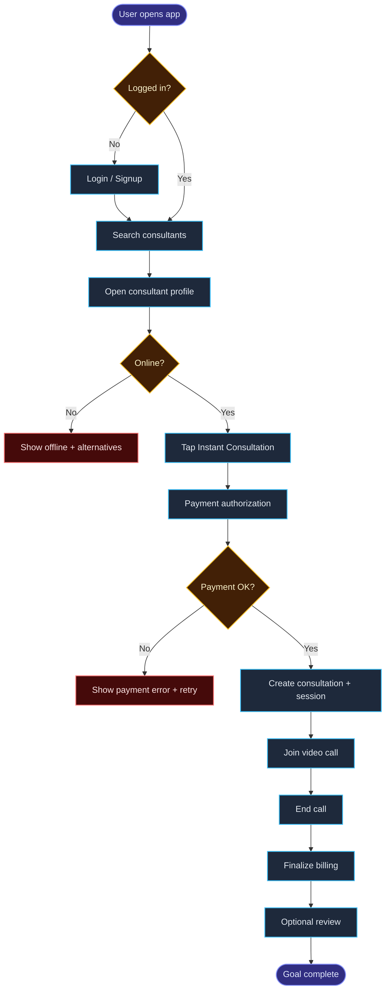

# User Journey (Product)

Product Designer হিসেবে journey মানে শুধু step list না — **visual map** যেখানে দেখা যায়:

```text
User কী চায় → কী করে → কী দেখে → কী decide করে → কোথায় আটকে → শেষে কী পায়
```

প্রতি feature-এর [Feature Template](/features/template) এর **Section 2** এই format follow করো।

---

## Journey board কী কী থাকবে?

| Layer | Purpose |
|-------|---------|
| **Story header** | Actor, goal, entry, success, emotion |
| **Stage map** | Big phases (Discover → Decide → Book → Experience → After) |
| **Emotion lane** | Visual emoji row per stage (happy + failure) |
| **Journey canvas** | Screenshot-style UX map (stages as columns) |
| **Step table** | প্রতি step: action, screen, thinking, emotion, system |
| **Flow diagram** | Mermaid visual path |
| **Decision points** | Yes/No branches |
| **Failure journeys** | Sad paths with recovery |
| **Pain & opportunity** | Product improvements |

---

## 1) Story header (সবসময় আগে)

```markdown
| Field | Value |
|-------|-------|
| Actor | User (patient / client) |
| Goal | Talk to a consultant right now |
| Entry point | Home / Search / Recommendation |
| Success moment | Live call connected |
| Primary emotion journey | Curious → Confident → Relieved |
```

---

## 2) Stage map (high-level phases)

বড় phase আগে ঠিক করো — পরে detail steps:

```text
[ Discover ] → [ Decide ] → [ Book & Pay ] → [ Experience ] → [ After ]
```

Feature pages-এ **stage cards** যথেষ্ট।  
একই ৫টা stage আবার Mermaid LR flowchart দিও না — সেটা **redundant**।  
Branching/decision detail চাইলে পরে **Visual flow** section ব্যবহার করো।

---

## Emotion lane (visual)

Stage map-এর ঠিক নিচে screenshot-style **Emotions** row রাখো — এক cell = এক stage (বা major step)।

### Live example

<div class="emotion-lane-wrap">
  <p class="emotion-lane-caption">Happy path</p>
  <div class="emotion-lane" role="group" aria-label="Example happy emotions">
    <div class="emotion-lane__label">Emotions</div>
    <div class="emotion-lane__track">
      <div class="emotion-cell">
        <span class="emotion-cell__face" aria-hidden="true">🙂</span>
        <span class="emotion-cell__name">Interested</span>
      </div>
      <div class="emotion-cell">
        <span class="emotion-cell__face" aria-hidden="true">😠</span>
        <span class="emotion-cell__name">Annoyed</span>
      </div>
      <div class="emotion-cell">
        <span class="emotion-cell__face" aria-hidden="true">😤</span>
        <span class="emotion-cell__name">Frustrated</span>
      </div>
      <div class="emotion-cell">
        <span class="emotion-cell__face" aria-hidden="true">😁</span>
        <span class="emotion-cell__name">Happy</span>
      </div>
      <div class="emotion-cell">
        <span class="emotion-cell__face" aria-hidden="true">😁</span>
        <span class="emotion-cell__name">Happy</span>
      </div>
    </div>
  </div>
</div>

### Copy-paste snippet

```html
<div class="emotion-lane-wrap">
  <p class="emotion-lane-caption">Happy path emotions</p>
  <div class="emotion-lane" role="group" aria-label="Happy path emotions">
    <div class="emotion-lane__label">Emotions</div>
    <div class="emotion-lane__track">
      <div class="emotion-cell">
        <span class="emotion-cell__face" aria-hidden="true">🙂</span>
        <span class="emotion-cell__name">Interested</span>
      </div>
      <div class="emotion-cell">
        <span class="emotion-cell__face" aria-hidden="true">🤔</span>
        <span class="emotion-cell__name">Evaluating</span>
      </div>
      <div class="emotion-cell">
        <span class="emotion-cell__face" aria-hidden="true">😬</span>
        <span class="emotion-cell__name">Tense</span>
      </div>
      <div class="emotion-cell">
        <span class="emotion-cell__face" aria-hidden="true">😌</span>
        <span class="emotion-cell__name">Relieved</span>
      </div>
      <div class="emotion-cell">
        <span class="emotion-cell__face" aria-hidden="true">😁</span>
        <span class="emotion-cell__name">Happy</span>
      </div>
    </div>
  </div>
</div>
```

Failure path-এর জন্য class যোগ করো: `emotion-lane emotion-lane--failure`

### Tips

- Cell সংখ্যা stage সংখ্যার সাথে মিলাও
- Face + short label (1 word best)
- Happy lane + worst failure lane দুটো রাখলে product gaps স্পষ্ট হয়
- Table-এর Emotion column এবং lane **same story** বলুক

**Emoji suggestions:** 🙂 Interested · 🤔 Evaluating · 😬 Tense · 😠 Annoyed · 😤 Frustrated · 😟 Worried · 😌 Relieved · 😁 Happy

---

## Journey canvas (screenshot-style UX map)

Stages = **columns**. Layers = **rows**:

```text
Stages | Discover | Decide | Book & Pay | Experience | After
Goals
Actions
Thoughts
Pain points
Emotions
Touchpoints
Opportunities
```

Use for product storytelling / workshops.  
Keep the [step board](/features/template#23-step-by-step-board-happy-path) for backend mapping.

Filled example: [Instant Consultation — Journey canvas](/features/instant-consultation#22c-journey-canvas-ux-map)

::: tip Markdown note
Journey canvas HTML-এর **ভিতরে blank line রাখো না**। VitePress/markdown-it blank line পেলে HTML block ভেঙে দেয় — তখন `<div>` raw text হয়ে যায়।
:::

---

## 3) Step-by-step journey table (সবচেয়ে important)

প্রতিটা step-এ এই columns রাখো।  
Table-কে wrap করো: `<div class="journey-board">…</div>`

<div class="journey-board">

| Step | Stage | User action | Screen / UI | User thinking | Emotion | System response | Backend? |
|------|-------|-------------|-------------|-----------------|---------|-----------------|----------|
| <span class="step-no">1</span> | <span class="stage-chip stage-chip--discover">Discover</span> | Opens app | <span class="screen-tag">Home</span> | <span class="user-thought">“I need help now”</span> | <span class="emotion-pill emotion-pill--tense"><span class="emotion-pill__face">😰</span>Anxious</span> | Show recommended | <span class="backend-flag backend-flag--optional">opt</span> |
| <span class="step-no">2</span> | <span class="stage-chip stage-chip--decide">Decide</span> | Opens profile | <span class="screen-tag">Profile</span> | <span class="user-thought">“Are they good?”</span> | <span class="emotion-pill emotion-pill--neutral"><span class="emotion-pill__face">🤔</span>Evaluating</span> | Show rate/online | <span class="backend-flag backend-flag--yes">✓</span> |
| <span class="step-no">3</span> | <span class="stage-chip stage-chip--book">Book</span> | Taps Instant | <span class="screen-tag">Confirm sheet</span> | <span class="user-thought">“Will this work?”</span> | <span class="emotion-pill emotion-pill--positive"><span class="emotion-pill__face">🙂</span>Hopeful</span> | Start book flow | <span class="backend-flag backend-flag--yes">✓</span> |

</div>

**Board helpers:** `step-no` · `stage-chip` · `screen-tag` · `user-thought` · `emotion-pill` · `backend-flag`  
**Emotion tips:** `emotion-pill--positive` / `--neutral` / `--tense` / `--negative`  
Also add the visual [Emotion lane](#emotion-lane-visual) above the table.

**Emoji suggestions:** 🙂 Interested · 🤔 Evaluating · 😬 Tense · 😠 Annoyed · 😤 Frustrated · 😟 Worried · 😌 Relieved · 😁 Happy

---

## 4) Visual flow (happy path)



---

## 5) Decision points (Product must design both sides)

| Decision | If Yes | If No | UI |
|----------|--------|-------|----|
| Online? | Enable Instant | Disable + suggest others | Profile CTA |
| Payment OK? | Create booking | Stay, show retry | Payment sheet |
| Session ready? | Join screen | Waiting / error recovery | Lobby |

---

## 6) Failure / recovery journeys

শুধু problem নয় — **recovery**ও লেখো:

| Failure | User feels | What user sees | Recovery path | System must |
|---------|------------|----------------|---------------|-------------|
| Consultant goes offline | Frustrated | “Unavailable” + similar list | Pick another | `409` + no fake booking |
| Card declined | Worried | Clear decline message | Retry / change card | No confirmed booking |
| Double tap | — | Same success state | — | Idempotent |

---

## 7) Experience timeline (optional but powerful)

Call/session features-এর জন্য:

```text
T0     Open profile
T+10s  Tap Instant
T+25s  Payment confirming…
T+40s  Join ready
T+…    In call
End    Summary + review
```

যেখানে user wait করে — সেখানেই loading copy ও trust design লাগে।

---

## 8) Pain → Opportunity

| Pain point | Where in journey | Opportunity |
|------------|------------------|-------------|
| Can’t tell if consultant is free | Decide stage | Strong online + ETA signal |
| Fear of wrong charge | Book & Pay | Show estimate + “charged after call” copy |
| Don’t know what happens next | After Instant tap | Step progress: Pay → Confirm → Join |

---

## Product Designer checklist

Journey done বলার আগে:

- [ ] Actor + goal clear
- [ ] Stages named
- [ ] Emotion lane filled (happy + failure)
- [ ] Journey canvas filled (goals / actions / thoughts / pain / emotions / opportunities)
- [ ] Happy path steps filled (action / screen / emotion / system)
- [ ] Mermaid (or equivalent) diagram added
- [ ] At least 3 failure + recovery paths
- [ ] Decision points designed for Yes and No
- [ ] Pain points converted to opportunities
- [ ] Each critical step marked: Backend touch? Yes/No

তারপর Bridge step-এ যাও: Screen → API map।

---

## Related

- [Feature Template — Section 2](/features/template#2-user-journey-product)
- [Instant Consultation example](/features/instant-consultation)
- [Dual-role Workflow](/guide/dual-role-workflow)
