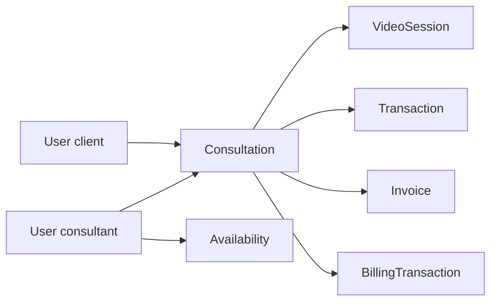

# Data Model (light)

Full-app **persistence contract** — what we store, how it relates, what must stay consistent.  
Not a dump of every Mongoose field (code remains source for full schemas).

Related:

- [Information Architecture](/product/information-architecture) — product objects & nav  
- [Glossary](/product/glossary) — canonical names  
- [Response Architecture](/standards/response-architecture) — API DTO ≠ DB document  
- Feature delta notes live in each feature’s **Data Model Notes** (see [template](/features/template#8-data-model-notes-backend))

---

## Principle

```text
IA / Glossary name
        ↓
Collection / model
        ↓
Indexes + invariants
        ↓
API DTO (never raw doc with secrets)
```

---

## Core collections

| Collection (model) | Owns | Links to |
|--------------------|------|----------|
| `User` | People (USER / CONSULTANT / ADMIN) | — |
| `Availability` | Consultant unavailable slots | `User` (consultant) |
| `Consultation` | Booked engagement + billing summary fields | `User` (user + consultant) |
| `Transaction` | Payment provider movements | `Consultation`, users |
| `Invoice` | Bill/receipt artifact | `Consultation` (field `session`), users |
| `BillingTransaction` | Per-minute / ledger-ish billing rows | `Consultation` |
| `VideoSession` | Live call channel/session | `Consultation` (1:1), users |
| `Review` | Ratings | consultation / users |
| `Report` | Session reports | `Consultation` |
| `Notification` | User notifications | `User` |
| `Transcription` / related | STT artifacts | consultation / session |

Exact schema files: `src/app/modules/**/**.model.ts`.

---

## Relationships (persistence view)

```text
User (client) ──┐
                ├──> Consultation ──1:1──> VideoSession
User (consultant)┘         │
                           ├──> Transaction[] (auth/capture/…)
                           ├──> Invoice?
                           ├──> BillingTransaction[]
                           ├──> Report?
                           └──> Review?
Consultant ──1:1──> Availability
```



---

## Critical enums (keep API + DB aligned)

### Consultation

| Field | Values (code today) |
|-------|---------------------|
| `bookingType` | `scheduled` \| `instant` \| `callback` |
| `status` | `pending` \| `ongoing` \| `accepted` \| `rejected` \| `confirmed` \| `completed` \| `cancelled` \| `expired` |
| `paymentStatus` | `pending` \| `authorized` \| `paid` \| `failed` |
| `billingStatus` | `pending` \| `authorized` \| `active` \| `failed` \| `completed` |

### VideoSession

| Field | Values |
|-------|--------|
| `status` | `pending` \| `ongoing` \| `ended` |

### Transaction

| Field | Values |
|-------|--------|
| `status` | `pending` \| `authorized` \| `captured` \| `failed` \| `refunded` \| `voided` |
| `type` | `authorization` \| `capture` \| `charge` |
| `provider` | `stripe` \| `paypal` |

Feature specs may use friendlier stage names (Journey “Experience”); **DB/API enums stay these strings** unless a migration says otherwise.

---

## Important indexes / uniqueness (today)

| Model | Index | Why |
|-------|-------|-----|
| Availability | `{ consultant: 1 }` unique | One availability doc per consultant |
| Consultation | `{ consultant, date, startTime, endTime }` | Slot collision queries |
| Consultation | `{ user, status }` | My bookings |
| Consultation | `{ status, bookingType }` | Ops / filters |
| Transaction | `{ transactionId: 1 }` unique | Provider idempotency |
| Transaction | `{ consultation: 1 }` | Lookup by booking |
| Invoice | `{ invoiceNumber: 1 }` unique | External reference |
| BillingTransaction | `{ consultationId, billingMinute, type }` unique | Prevent duplicate minute charges |
| VideoSession | `{ consultation: 1 }` unique | One live session per consultation |
| VideoSession | `{ channelName: 1 }` unique | Agora channel |

When adding features: document new unique constraints here + in the feature Data notes.

---

## Money & integrity invariants

1. **Server owns amounts** — `perMinuteRate`, `authorizedAmount`, `consumedAmount`, `finalSettledAmount` are not client authority.
2. **No confirmed money lie** — do not leave `paymentStatus: authorized/paid` without a matching provider `Transaction` (or explicit failed cleanup).
3. **Ledger trail** — captures/charges/refunds should be representable in `Transaction` / `BillingTransaction` (see billing tests).
4. **Invoice** is a derived artifact of a settled consultation/session — not a substitute for transaction history.
5. Prefer future API money shape `{ amount, currency }` even if DB stores number + `currency` field separately.

---

## Security (what must not leak via API)

Even if stored on `User` / `VideoSession` / payment metadata:

- password hashes  
- raw provider secrets / unnecessary internal ids  
- internal-only flags  

Map through DTOs — [Response Architecture](/standards/response-architecture).

---

## Concurrency notes (product-wide)

| Risk | Mitigation direction |
|------|----------------------|
| Double instant book / double charge | Idempotency keys + unique provider `transactionId` |
| Two users same consultant/slot | Availability + consultation indexes + transactional checks |
| Join/end races | Session status transitions; idempotent end |
| Billing tick vs end | Billing suite / single finalize winner |

Detail per feature in Data Model Notes.

---

## How features use this page

1. Confirm object names via [Glossary](/product/glossary)  
2. Touch only needed collections in the feature  
3. Fill feature **§ Data Model Notes** (fields, indexes, money, concurrency)  
4. Keep API contracts in feature **§ API** — DTO out, not raw docs  
5. Prove with `__tests__` (especially `billing/`)

---

## Checklist for schema changes

- [ ] Glossary / IA updated if new concept  
- [ ] This data-model page updated (collection / index / enum)  
- [ ] Feature Data notes updated  
- [ ] API contract / DTO updated  
- [ ] Migration / index deploy noted  
- [ ] Tests covering invariant
