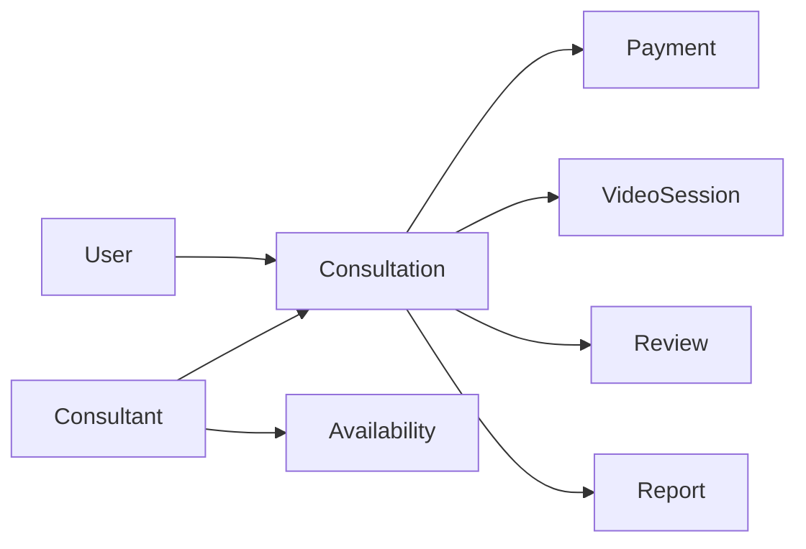

# Information Architecture

Full-product map of **what exists**, **how it relates**, and **where users find it**.  
Feature journeys live in `/features` — this page owns structure.

Related: [Glossary](/product/glossary) · [Card Sorting](/product/card-sorting) · [Data Model](/product/data-model)

---

## 1. Core objects

| Object | Meaning | Notes |
|--------|---------|--------|
| User | Client who books help | Auth role: USER |
| Consultant | Expert who delivers sessions | Auth role: CONSULTANT |
| Consultation | Booked engagement between user & consultant | Prefer this canonical name over “booking” in API |
| Payment | Money movement / authorization / capture | Tied to consultation |
| Invoice | Bill / receipt artifact | User-facing money record |
| VideoSession | Live call channel for a consultation | Agora-backed |
| Review | Rating/feedback after session | |
| Report | Consultant/admin session report | |
| Notification | In-app / push message | |
| Availability | Consultant blocked/open slots | |

---

## 2. Relationships

```text
User ──books──> Consultation <──with── Consultant
Consultation ──has──> Payment
Consultation ──has──> VideoSession
Consultation ──may have──> Review
Consultation ──may have──> Report
Consultation ──may have──> Invoice / ledger entries
Consultant ──owns──> Availability
```



---

## 3. Navigation map (draft)

Fill/adjust after card sorting. Starter proposal:

### User app

| Group | Items |
|-------|--------|
| Discover | Home, Search consultants, Recommendations |
| Sessions | My bookings / consultations, Upcoming, Past |
| Money | Wallet / payment methods, Invoices |
| Me | Profile, Notifications, Support |

### Consultant app

| Group | Items |
|-------|--------|
| Work | Incoming / today’s sessions, Availability |
| Earnings | Payouts, invoices summary |
| Reputation | Reviews, reports |
| Me | Profile, Notifications, Support |

### Admin

| Group | Items |
|-------|--------|
| People | Users, Consultants |
| Operations | Consultations, Reports, Disputes |
| Content | FAQ, Terms, Privacy |
| System | Config, audits |

---

## 4. API resource alignment (high level)

Keep UI labels close to these routes when possible:

| UI idea | API area |
|---------|----------|
| Consultants / profile | `/api/v1/user`, recommendations |
| Book / my sessions | `/api/v1/consultation` |
| Live call | `/api/v1/video-session`, agora |
| Pay | `/api/v1/payment` |
| Reviews | `/api/v1/review` |
| Reports | `/api/v1/report` |
| Notifications | `/api/v1/notification` |

Detail contracts stay inside each feature spec.

---

## 5. IA checklist

- [ ] Objects named in [Glossary](/product/glossary)
- [ ] Relationships still true after new features
- [ ] Nav groups match card-sorting findings (when run)
- [ ] No duplicate concepts with different names across UI/API/DB
- [ ] New feature placed under an existing object — or glossary updated first
